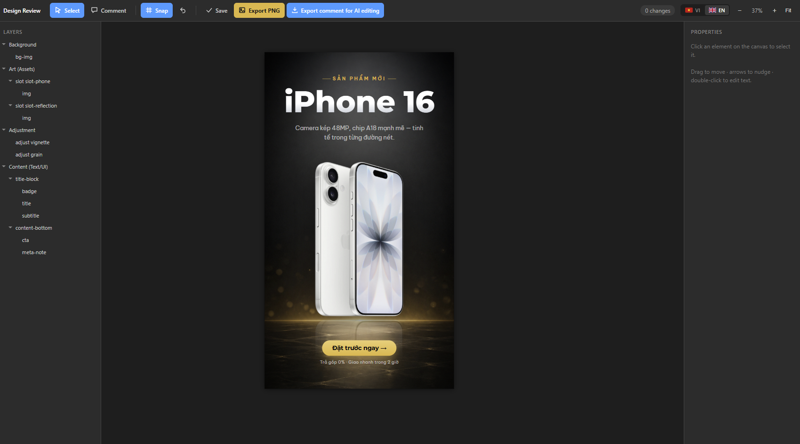

# ai-agent-design-toolkit

**Tư duy design tool cho AI agent.** Ghép ảnh truyền thông bằng HTML phân lớp (Nền → Đồ họa → Adjustment → Chữ), review trên browser như Figma, xuất PNG chuẩn pixel — vòng review/xuất không tốn token AI nào.

*English: [README.md](README.md)*



Xây cho AI coding agent (Claude Code, Codex, Qwen...) đọc skill và làm theo, nhưng mọi công cụ đều chạy độc lập được.

## Vì sao

AI gen ảnh vẽ chữ rất tệ (nhất là tiếng Việt có dấu), không tạo được QR thật, và đổi một chữ là phải gen lại cả ảnh. Bộ công cụ này chia việc đúng như designer làm:

| Lớp | Công cụ | Lý do |
|---|---|---|
| Nền | ảnh AI gen hoặc CSS | chất liệu nghệ thuật |
| Đồ họa / asset | PNG trong suốt trong slot cố định | thay ảnh không vỡ bố cục |
| Adjustment | CSS filter/blend (như adjustment layer Photoshop) | đổi mood không cần gen lại |
| Chữ & CTA | HTML/CSS thuần | chữ đúng 100% mọi ngôn ngữ, QR thật |

Browser chính là bản render sống. Review server local biến Lưu-vào-source và Xuất-PNG thành một cú click, offline, 0 token.

## Trong gói có gì

```
skills/design--compose/
├── SKILL.md                    # Quy trình đầy đủ cho AI agent
├── templates/social-frame.html # Khung 3 lớp, 4 style preset, hệ slot
├── config/style-registry.json  # Palette, font, art-direction block từng style
├── assets/fonts/               # Be Vietnam Pro + Baloo 2 (subset tiếng Việt, SIL OFL)
└── scripts/
    ├── compose-screenshot.py   # HTML → PNG đúng pixel (Chrome headless)
    ├── review-overlay.js       # Editor trên browser (layers, multi-select, snap, undo, comment)
    ├── review-server.py        # Server local: nút Lưu + Xuất PNG
    ├── fetch-fonts.py          # Tải Google Fonts subset tiếng Việt về máy
    └── trim-alpha.py           # Cắt viền trong suốt của ảnh tách nền
workflows/design-compose-pipeline.md  # Pipeline đầy đủ: gen AI → tách nền → ghép → review
knowledge/                            # sessions/ · patterns/ · prompts/ — experience log (see knowledge/README.md)
```

## Yêu cầu

- Google Chrome (hoặc Edge) — chụp headless
- Python 3.10+ — script dùng thư viện chuẩn, riêng `trim-alpha.py` cần `pip install pillow`
- Tùy chọn: `npm i -g rmbg-cli` (tách nền AI), backend gen ảnh (vd Codex CLI)

## Nối backend gen ảnh (tùy chọn)

Toolkit không gọi cứng generator nào — bạn tự mang backend. Ba đường phổ biến:

1. **Agent của bạn là Codex CLI** — nó có tool `image_gen` native; chỉ cần yêu cầu render prompt file ra PNG đúng tỉ lệ.
2. **Agent là Claude Code (hoặc khác) + đã cài Codex CLI** (`codex` >= 0.130, đã login):
   ```bash
   codex exec "Doc prompts/01-bg.md, gen anh bang tool image_gen ti le 9:16, luu PNG vao assets/bg.png"
   ```
3. **Generator bất kỳ khác** (Imagen, DALL·E, Midjourney...) — gen ở đâu cũng được, thả file PNG vào thư mục design. Skill chỉ cần file ảnh.

Quy tắc prompt quan trọng (mọi backend) nằm ở `knowledge/prompts/`.

## Cài đặt

1. Copy `skills/design--compose/` vào thư mục skills của workspace (vd `.claude/skills/`).
2. Copy `workflows/design-compose-pipeline.md` vào thư mục workflows nếu có.
3. Template tham chiếu skill qua placeholder `file:///<path-to-skill>` — thay bằng đường dẫn thật của bạn, hoặc đơn giản là luôn review qua `review-server.py`: server tự map placeholder, và lần **Lưu** đầu tiên sẽ tự ghi đường dẫn tuyệt đối đúng.

## Dùng nhanh

```bash
# 1. Nhờ AI agent ghép thiết kế (nó đọc SKILL.md), hoặc tự copy template
# 2. Bật review server và mở editor:
python skills/design--compose/scripts/review-server.py --dir <thư-mục-design> --port 7799
# rồi mở: http://127.0.0.1:7799/<design>.html#review

# 3. Chỉnh trực tiếp, bấm "Xuất PNG" — xong. Không tốn token AI.
```

## Editor review

- **Chọn (V)**: click = group ngoài · double-click = vào sâu 1 cấp · Ctrl+click = element sâu nhất · Shift+click = thêm/bớt nhóm · quét vùng trống = chọn nhiều
- Kéo thả với **snap & alignment guides** (mép/tâm frame + element khác, giữ Alt để tắt) · mũi tên nudge 2px, Shift = 10px · Delete ẩn element
- Double-click chữ sửa tại chỗ — panel phải chỉnh X/Y/W/H, xoay, mờ, lật, thứ tự lớp, cỡ chữ
- **Layers panel**: cây phân lớp, ẩn/hiện từng lớp, chọn chính xác
- **Comment (C)**: click = ghim điểm, kéo = khoanh vùng; click pin xem lại ghi chú
- **Ctrl+Z** hoàn tác · **Space+kéo** pan · **Ctrl+lăn** zoom tại con trỏ
- **Xuất feedback**: tải JSON mọi thay đổi + comment — đưa AI agent khi cần nó thiết kế tiếp
- **Lưu**: ghi chỉnh sửa live vào file HTML source (backup `.bak`)
- **Xuất PNG**: lưu source trước rồi chụp — PNG và HTML không bao giờ lệch nhau

## Nguyên tắc thiết kế trong skill

1. **Không bao giờ để AI vẽ chữ.** Chữ luôn là HTML — đúng mọi ngôn ngữ, QR quét được thật.
2. **Frame-first**: slot định nghĩa layout, ảnh chỉ fill vào (`object-fit`) — gen lại asset không vỡ bố cục.
3. **Trim viền trong suốt** mọi asset alpha trước khi vào slot (`trim-alpha.py`).
4. **Bóng và phản chiếu tự dựng** bằng CSS, không nhờ AI vẽ.
5. **Font có tính cách**: chọn theo mood từng thiết kế, tải subset tiếng Việt về local (`fetch-fonts.py` tự cảnh báo font thiếu tiếng Việt).

## Biến nó thành của bạn

Bộ công cụ chỉ đóng gói các quy tắc lõi — nó được thiết kế để lớn lên theo quá trình dùng. Bản gốc được xây qua hàng chục vòng feedback người thật, và trải nghiệm của bạn sẽ khác:

- **Thêm style riêng** vào `config/style-registry.json` (palette + khối `art_direction` cho prompt AI)
- **Session notes** — cuối mỗi phiên, agent ghi lại diễn biến vào `knowledge/sessions/`, mẹo kiểm chứng lên `knowledge/patterns/`, sổ prompt theo backend ở `knowledge/prompts/` (xem [knowledge/README.md](knowledge/README.md); đã seed sẵn bằng chính phiên xây dựng bộ công cụ)
- **Ghi bài học mới thẳng vào `SKILL.md`** — nó là sổ tay sống cho AI agent của bạn, không phải spec đóng băng. Mọi ghi chú cảnh báo trong đó đều đến từ một lỗi thật bị bắt khi review.
- **Prompt-craft nâng cao** cho gen ảnh AI chủ đích không đóng gói — mỗi backend một tính nết. Hãy giữ sổ prompt riêng và dạy lại agent của bạn theo đúng cách đó.

## Ủng hộ

Nếu bộ công cụ này giúp bạn tiết kiệm thời gian, có thể mời tác giả một ly cà phê:

[](https://ko-fi.com/hoangkimquoc)

## License

Code: [AGPL-3.0](LICENSE) — tự do dùng, sửa, kể cả bán; nhưng mọi bản phân phối hoặc chạy thành dịch vụ mạng phải công khai toàn bộ mã nguồn theo cùng license. Fonts đi kèm (Be Vietnam Pro, Baloo 2): [SIL Open Font License 1.1](skills/design--compose/assets/fonts/OFL.txt).

---
Xây qua quy trình pair-design người + AI agent — Hoàng Kim Quốc, 2026 · [Ko-fi](https://ko-fi.com/hoangkimquoc)
